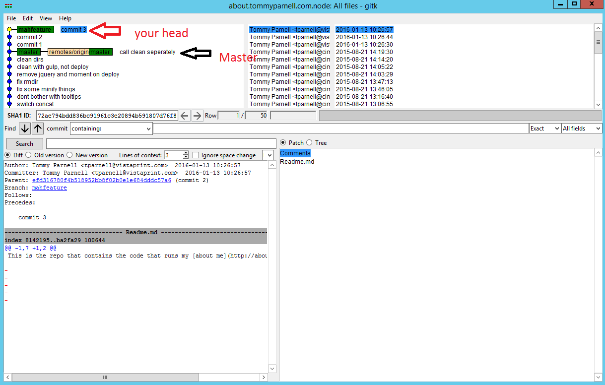

## Committing:

Making a commit in git involves 3 steps:

Step 1. Stage the files to be committed

Step 2. make a commit and leave a Message

Step 3. Push the commit to the remove server

Step 1:

`git add .` OR `git add path/to/file` OR `git add *.png`

***doing git add . will stage all files in the current directory down that are not gitignored (and is often the easiest way)***

Step 2:

`git commit -m "Your Message"`

Step 3:
`git push origin YourBranchName` (master could go here..)

## Branching:

List branches: `git branch`

Create branch with the current branch `git checkout -b NewBranchName`

delete local branch `git branch -D BranchName`

push delete branch `git push origin :branchName`

## Cloning

To put cloning in lamens term you download the remote repository locally

`git clone https://github.com/tparnell8/Git-CheatSheet.git`

## Merging

merge/rebase a branch into current branch by doing the following

`git fetch --all` (fetch all changes from remote server)
`git merge origin/BranchNameToMergeFrom` OR `git rebase origin/BranchNameToMergeFrom` (merge in the changes from the remote branch)

### Rebase or merge

***Rebase*** rewinds your commits back until you are at the same commit as the other branch. Then applies their changes, and then your changes. this is good if you want all of your commits at the tip of the branch, but may cause excessive merge conflicts.

***Merge*** simply merges the target branch into your branch.

## Forking

Fork is where you get your own remote copy of the repository. There is a fork button in github, which will make a copy of the repo. After you make your changes in that repo, you can submit a pull request which will ask them to pull in the changes in your fork.

## Rewind commits
To move back to a previous commit, but keep the changes as unstaged do `git reset HEAD~1`

To move back to the previous commit and throw away the changes do `git reset HEAD~1 --hard`

## Revert commits

Reverting commits is not simple in git, but not really hard. If the commits are at the tip of the branch it may be easier to Rewind commits and force push. Otherwise you can use the git revert command

Revert a specific commit: `git revert <shaOfCommit>` ex. `git revert 08df7a`

Revert a merge commit `git revert -m 1 <shaOfMergeCommit>` ex. `git revert -m 1 08df7a`

## Submodules

Submodules are basically nested git repos...

Add a new submodule: `git submodule add https://RepoOfSubmodule`

Remove submodule files: `git submodule deinit .`

Clone Submodule Files: `git submodule update --init --recursive`

Change clone url of submodule:
* Fix the url in the `.gitmodules` file
* Commit the changes of the `.gitmodules` file
* Run `git submodule sync --recursive`

## Squishing commits

If you have multiple commits and someone asks you to "squish them" they are asking you to convert your 5+ commits to be a single commit

The easiest way to do that is to count how many commits you have from master. Then just do `git reset HEAD~<YourCommitCountHere>` ex. `git reset HEAD~3` then afterwards make a new commit. You will then need to force push to your branch `git push origin YourBranchName --force`

